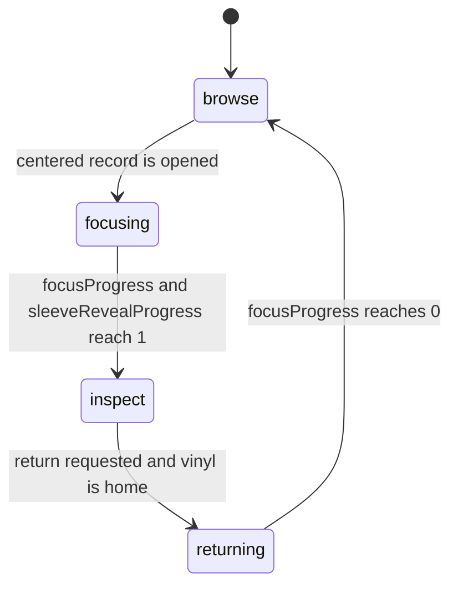
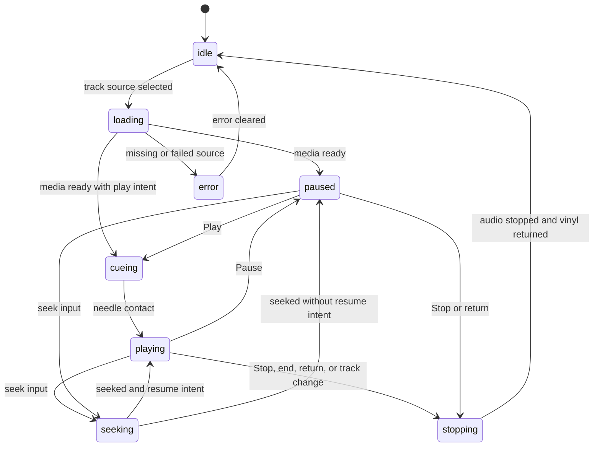
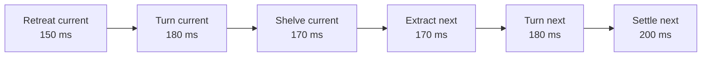

# Motion, audio, and animation

Side One coordinates a shelf, sleeve inspection, turntable, audio
playback, and accessible HTML without giving multiple systems ownership of the
same frame. React owns durable interface state, `RecordShelfEngine` owns visual
transition progress, `VinylAudioController` owns browser audio, and pure
functions define legal state changes and spatial poses.

There is no general-purpose tweening library and no secondary waveform or
turntable animation loop.

## Source map

- `app/RecordShelfEngine.ts` owns Three.js, input, scripted cameras, the one
  repeating `requestAnimationFrame`, visual playback state, analyser sampling,
  diagnostics, and disposal.
- `app/record-motion.ts` contains pure shelf poses, separating-axis collision
  math, vinyl transport poses, and tonearm poses.
- `app/VinylLibrary.tsx` coordinates engine callbacks, audio callbacks, React
  state, accessible controls, status announcements, and pending user intent.
- `app/audio/playback-state.ts` defines the pure playback reducer and rejects
  stale media events by request ID.
- `app/audio/VinylAudioController.ts` owns one reusable `HTMLAudioElement` and
  its lazy `MediaElementAudioSourceNode → GainNode → AnalyserNode → destination`
  graph.
- `app/audio/audio-visualizer.ts` supplies pure log-band sampling and
  frame-rate-independent smoothing helpers.
- `app/record-art.ts` supplies deterministic front, back, spine, and label
  canvases.
- `app/record-catalog.ts` supplies dimensions, pressing materials, track
  metadata, and local media URLs.
- `app/globals.css` projects durable scene and playback classes into responsive
  HTML transitions.

## Ownership boundaries

`RecordShelfEngine` is the only owner of:

- `WebGLRenderer`, scene, camera, OrbitControls, and ResizeObserver;
- raycasting and pick proxies;
- record, platter, tonearm, and camera transforms;
- browse, focus, cue, and return progress;
- the repeating animation frame and render call;
- canvas diagnostics and Three.js resource disposal.

React receives meaningful changes such as selected index, scene mode, playback
mode, error, and status. It does not receive object positions, rotations,
platter angles, analyser arrays, or other per-frame values.

`VinylAudioController` owns media loading, audio-context unlock, playback,
seeking, gain, analyser sampling, cancellation, and audio disposal. It exposes
snapshots and callbacks; it never moves scene objects.

## Object hierarchy

Each album uses presentation wrappers that keep shelf motion independent from
the visual source:

```text
scene
├── shelfGroup                         horizontal browse translation
│   ├── shelfFurniture                 walnut shelf and rails
│   └── slot                           permanent catalog x-position
│       └── content                    browse/focus x, z, yaw, scale
│           └── inspectionIdle         reduced-motion-aware idle transform
│               ├── sleeve             jacket and front/back/spine surfaces
│               │   └── sleeveMouthFlex open edge, inner lip, and thumb notch
│               └── pickProxy          one invisible raycast box
├── vinyl                              independently transported pressing
│   ├── annular disc, label, and true center bore
│   ├── groove and optional marbling details
│   └── reactive glow
└── turntable
    └── turntableBase
        ├── layered plinth, isolation feet, and controls
        ├── platterAssembly            independent spin, mat, rim, strobe dots
        ├── tonearmPivot               gimbal yaw
        │   └── tonearmLift            cue height, curved arm, cartridge, stylus
        └── reactive rings
```

The slot never animates locally. `content` receives the album presentation
pose. The vinyl is attached directly to the scene because it must leave the
sleeve and travel to a turntable outside the shelf hierarchy.

Procedural textures exist first. Optional cover, back, and label images replace
only their corresponding texture after a successful load, so media swaps do
not change the animation coordinate system.

## One frame owner

`RecordShelfEngine.animate()` is the only repeating animation loop. Each frame
it:

1. clamps `delta` to at most 50 ms;
2. advances browse, focus, and return state;
3. applies record and inspection-idle poses;
4. advances or reverses cue choreography;
5. samples preallocated analyser data and updates visual response;
6. updates OrbitControls only while enabled;
7. renders once;
8. projects the label anchor into CSS pixels for the semantic play control;
9. refreshes diagnostics at most twice per second.

The audio controller returns the same analyser array on every sample. The
engine reduces it into reusable low, mid, and high buckets and damps the visual
response without pushing data through React.

## Separate state machines

Scene choreography and audio playback intentionally use separate state
machines.



OrbitControls are disabled in `browse`, `focusing`, and `returning`. They are
enabled only after the selected record reaches `inspect`, and disabled again
during scripted cue motion.



The playback reducer increments a request ID for each new source. Media events
from superseded loads are ignored, preventing a late callback from reviving an
old track.

Coordination rules live at the boundary:

- cueing begins only when scene mode is `inspect`;
- one record and one media source are active;
- returning while playback or cue motion is active first starts controlled
  stop and reinsertion;
- selecting another track during cue/play stores the request, reverses the
  current vinyl path, then loads the pending track;
- selecting another album while focused stores the target, returns the current
  album, then focuses the new one;
- missing or failed audio enters `error`, stops cue motion, and restores a
  stable inspect pose;
- repeated play, stop, return, and stale media events are idempotent.

## Browse choreography

All browse inputs converge on `targetScrollIndex`; `scrollIndex` damps toward
that target and drives `shelfGroup.position.x`. After 150 ms without pointer
input, the target damps toward the nearest integer for a magnetic landing.

The visible handoff is discrete:



`browseRecordMotionPose()` samples every phase from normalized progress. The
rotation lane is derived from the largest sleeve’s rotated radius and the
catalog collision margin. A sleeve reaches that clear lane before its yaw
changes.

The shelf slab and rear rail derive their width from the complete collection
plus a 6.4-unit end allowance. That keeps both rounded ends outside the normal
desktop composition while leaving the record slots and collision lanes
unchanged.

Raycasting uses one invisible box per record. A pointer gesture must remain
under seven pixels to count as a click, which prevents an archive swipe from
opening a sleeve. Off-center focus intent is stored until the record has
completed its browse handoff.

## Focus and return

Focus takes 460 ms. The 580 ms sleeve reveal begins once focus reaches 62%, so
the physical and camera motions overlap without hiding either action. Focus
first clears neighboring sleeves, moves into the inspection composition, and
scales. `sleeveRevealProgress` then flexes the mouth and slides the pressing
from fully enclosed to the staged label-visible pose. Its final jacket yaw is
exactly zero and the camera optical axis stays parallel to the jacket normal,
so the sleeve is face-on even though the composition places it left of center.
The camera uses exponential, frame-rate-independent smoothing and a view offset
on desktop to reserve distinct sleeve, vinyl, turntable, player, and
album-panel zones. Resetting an inspected camera interpolates back to the
scripted composition over 420 ms instead of snapping.

Mobile uses a centered, smaller sleeve pose and wider camera. The compact
details/player layout takes priority and the turntable stage is scaled at the
engine’s 760 px mobile breakpoint.

An idle return first reverses the 540 ms sleeve reveal until the pressing is
fully enclosed, then follows the current live `focusProgress` toward zero over
340 ms. A return from cue/play completes the tonearm, platter, transport, and
reinsertion path before camera return begins. Neither route resets the record
or camera to a guessed start pose.

## Cue choreography

Cue poses are pure samples from `cueMotionPose(phase, progress, layout,
grooveProgress, reinsertTarget)`.


The transport phase approaches from above before settling on the platter. The
tonearm first rotates over the selected groove and then lowers; the
`onNeedleContact` callback starts audible playback only when the stylus reaches
contact.

Opening inspection animates the vinyl through three physical extraction
waypoints: the pressing first slides at the pocket depth to the open edge, then
continues until its trailing edge clears the mouth, and only then moves forward
and tilts into the staged position. The first two segments use a shared Hermite
velocity at the sleeve mouth, preventing a visible pause at that waypoint.
`sleeveOpeningContract` owns the right-edge direction, pocket depth, and
clearance used for every jacket size.

`RecordShelfEngine` projects the live label position after the single render
and updates one semantic HTML play button imperatively, avoiding frame-level
React state. That control stays centered on the pressing during extraction,
transport, cueing, playback, pausing, and return. Its semantic action changes
between Play and Pause without rotating the HTML control with the record.
Cueing continues from the live staged pose rather than snapping the vinyl back
into the jacket.

During playback, `currentTime / duration` maps to `grooveProgress`, which moves
the tonearm from lead-in to runout. Seeking raises the arm visually and updates
the groove target. Pausing lifts the stylus slightly and slows the platter
without returning the pressing.

Stop reverses from live progress:

- while lowering or playing, it changes to `raise-tonearm`;
- while moving to the turntable, it reverses into `return-to-sleeve`;
- while extracting, `reinsertProgressForExtraction()` maps the live pose into
  `reinsert-vinyl` without a discontinuity.

Stopping while remaining in inspection targets the staged reveal; returning to
the archive targets full enclosure. After reinsertion, the engine fires
`onVinylReturned` once. A queued track may then load, or a pending return may
begin. This prevents teleports and keeps repeated commands safe.

## Pressing and spindle fit

`app/turntable-model.ts` owns one local-space dimensional contract shared by
the pressing and platter:

- the pressing is an extruded annulus with a real center bore;
- the label is a ring and does not paint over the bore;
- the lathed spindle is narrower than the bore with a small positive clearance;
- its rounded tip extends only slightly above the label;
- the record center height derives from the platter-mat top, record thickness,
  and a small physical clearance rather than a world-space magic number.

Because the pressing and turntable receive the same platter scale, these
relationships remain intact at every responsive desktop presentation scale.

## Audio and reactive visuals

The audio graph is created lazily in a user gesture:

```text
HTMLAudioElement
└── MediaElementAudioSourceNode
    └── GainNode
        └── AnalyserNode
            └── AudioContext.destination
```

Only one element and graph are reused across tracks. Loading and seeking
promises are cancellable; stop is promise-coalesced; fades use the gain node.
The controller removes listeners, clears the media source, closes the context,
and rejects pending work during disposal.

While playing, analyser energy affects:

- three rings around the platter;
- platter emissive intensity;
- pressing edge glow and scale;
- stylus emissive intensity.

Audio response falls back smoothly to zero when no analyser is available.

## Turntable variants

The turntable presentation is split into two groups:

- `turntableProceduralShell` is the replaceable chassis;
- `turntablePlaybackMechanism` owns the platter, spindle, tonearm, stylus, and
  analyser-driven rings.

`app/turntable-variants.ts` is the data owner for player IDs, labels, asset
paths, transforms, and availability. `VinylLibrary` owns the selected setting
and persists it under `side-one:turntable-variant`, with one-time migration
from the former preference key.
`RecordShelfEngine.setTurntableVariant()` swaps only the chassis, so playback
state and mechanical alignment survive a visual change. Mint GLBs load through
the shared Draco-capable helper in `app/assets/gltf-runtime.ts`; generated
files and their synchronized metadata belong in the project-root
`mint-assets.json`.

## Collision safety

Before the engine commits a shelf pose, it creates a top-down oriented
rectangle containing:

- the permanent slot plus proposed local offset;
- current yaw and presentation scale;
- sleeve width and thickness;
- the motion layout’s collision margin.

`recordFootprintsOverlap()` applies the separating axis theorem against every
other record. An overlapping pose is rejected and recorded in diagnostics.
Pure tests sample all six browse phases, desktop/mobile focus routes, and cue
poses without requiring WebGL.

Shelved slots share the exported `recordShelfGap`, currently `0.22` scene
units. The presented sleeve settles at zero yaw so its artwork is flat to the
browse camera. It offsets slightly left so the full lineup remains readable,
but that lateral move occurs only in the forward rotation lane; the sleeve
returns to its slot center before entering the shelf row. The visual jacket is
a thin cardstock pocket with an open edge, inner-paper lip, thumb notch, folded
seams, and a rear glue flap rather than a rounded solid volume.

If catalog sizes move outside the ranges in `docs/adding-records.md`, rerun the
motion tests before changing phase constants or the collision margin.

## Performance and lifecycle

- One renderer, scene, camera, ResizeObserver, raycaster, and repeating frame
  loop have one lifecycle owner.
- Procedural canvases become mipmapped sRGB textures with capped anisotropy.
- Optional images replace and dispose the prior procedural GPU texture.
- Raycasts use simple proxies and an explicit pick list.
- Device pixel ratio is capped at `1.75` on desktop and `1.5` below 760 px.
- One directional light casts shadows; its map is `2048²` on larger screens
  and `1024²` below 700 px.
- Nonselected records and shelf furniture are hidden once focus isolation is
  established.
- Geometries, materials, textures, controls, listeners, observers, audio
  nodes, and renderer resources are disposed at unmount.
- Per-frame vectors, poses, analyser buffers, and the projected vinyl anchor
  are reused rather than recreated in the hot path.

## Diagnostics

After client initialization:

```js
window.__VINYL_LIBRARY__.diagnostics()
```

The returned snapshot contains:

- `sceneMode`, `playbackMode`, browse `motionPhase`, and `cuePhase`;
- active and selected indices plus record count;
- cue progress and sleeve reveal progress;
- draw calls, triangles, geometries, textures, and pixel ratio;
- rolling frame-time sample count, mean, p95, maximum, and counts above 20 and
  32 ms;
- collision rejects, last rejected pair, and current collision;
- low, mid, high, and aggregate audio levels;
- drawing-buffer and CSS canvas dimensions.

The same high-level values are mirrored into canvas `data-*` attributes every
500 ms, including `data-frame-p95`, `data-frame-max`, and
`data-frame-over20`. The command surface also exposes `browse(index)`,
`focus(index)`, `play(trackId?)`, `pause()`, `stop()`, `resetView()`, and
`returnToShelf()`. It does not expose mutable Three.js or Web Audio internals.

Diagnostics aid automated QA but do not replace browser profiling.

## Reduced motion

The engine subscribes to `prefers-reduced-motion` and applies changes without a
reload. When enabled:

- each browse phase uses 45% of its normal duration with a 55 ms floor;
- focus, sleeve open, sleeve close, and return use 80–100 ms;
- each cue phase uses 90 ms;
- shelf and camera response becomes stronger;
- inspection idle lift and rotation are disabled.

CSS independently collapses interface transitions. Dialogs remain mounted for
their short exit transition, while closed layers become inert immediately.
State changes, needle ordering, error handling, and accessible announcements
remain intact even when the choreography is shortened.

## Safe change checklist

1. Keep `RecordShelfEngine` as the sole owner of frame-level Three.js state.
2. Keep media and Web Audio ownership inside `VinylAudioController`.
3. Put reusable transitions in `playback-state.ts` and reusable spatial math in
   `record-motion.ts`.
4. Preserve the rotation lane before changing sleeve yaw.
5. Keep OrbitControls disabled during scripted camera and cue motion.
6. Preserve request IDs and cancellation when changing audio loading.
7. Test ordinary and unusually thick sleeves, interrupted cue phases, missing
   audio, repeated commands, and track changes.
8. Run:

   ```bash
   npm run check
   npm run security:audit
   ```

9. For rendering changes, verify the production build with real pointer,
   keyboard, wheel, WebGL, and audio input on desktop and around 390 × 844.
10. Inspect `window.__VINYL_LIBRARY__.diagnostics()`, the browser console,
    network requests, canvas pixels, resize behavior, and reduced motion.
